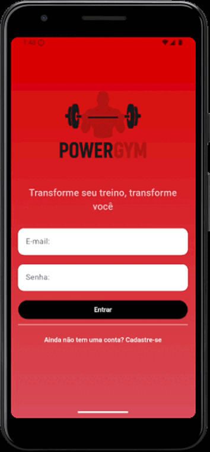

# 📱 PowerGym

Aplicativo mobile de auxílio na academia, desenvolvido em **Flutter** como projeto da disciplina **Programação para Dispositivos Móveis**.  

---

## 📌 Índice  
- [Descrição](#-descrição)  
- [Funcionalidades](#-funcionalidades)  
- [Tecnologias Utilizadas](#-tecnologias-utilizadas)  
- [Pré-requisitos](#-pré-requisitos)  
- [Instalação e Execução](#-instalação-e-execução)   
- [Conlusão](#-conclusão)   
- [Demonstração](#-demonstração)   

---

## 📖 Descrição  
O **PowerGym** é um aplicativo mobile criado com **Flutter** para auxiliar alunos e instrutores de academias no gerenciamento de treinos e exercícios.  
O projeto foi desenvolvido como protótipo acadêmico, mas possui potencial de aplicação prática, oferecendo uma plataforma intuitiva, responsiva e multiplataforma.  

---

## ⚙️ Funcionalidades  

- Tela de **Login**: autenticação simples com usuário e senha, garantindo acesso seguro ao sistema.  
- Tela de **Cadastro**: registro de novos usuários, incluindo informações básicas.  
- Tela inicial / **Dashboard**: visão geral das principais funcionalidades do aplicativo.  
- **Listagem de exercícios**: exibição organizada por categorias, mostrando nome, séries e repetições.  
- **Listagem de treinos**: planos de treino estruturados, permitindo rápida consulta e acompanhamento.
- **Listagem de sentimentos**: acompanhamento do humor ou motivação do aluno durante o treino.
- **Informações de perfil**: Informações do perfil do usuário autenticado.
- **Estatísticas**:  
  - **Informações do perfil**: dados e progresso do usuário.  
- **Cadastro de exercícios**: adição de novos exercícios com detalhes como nome, categoria, séries e repetições.  
- **Cadastro de treinos**: criação de planos de treino associando diferentes exercícios de forma estruturada.   

---

## 🛠️ Tecnologias Utilizadas  
- [Flutter](https://flutter.dev/)  
- [Dart](https://dart.dev/)  
- IDE: **Visual Studio Code**  
- Controle de versão: **Git** + **GitHub**  

---

## 🔧 Pré-requisitos  
Antes de rodar o projeto, você precisa ter instalado:  
- [Flutter SDK](https://docs.flutter.dev/get-started/install)  
- [Dart](https://dart.dev/get-dart)  
- Um emulador Android/iOS ou dispositivo físico conectado  

---

## 🚀 Instalação e Execução  

```bash
# Clone este repositório
git clone https://github.com/ryannardelli/gym_app.git

# Acesse a pasta do projeto
cd gym_app

# Instale as dependências
flutter pub get

# Execute o aplicativo
flutter run
```

> **Observação:**  
> Além de usar o terminal, você também pode abrir o projeto em uma IDE como **Visual Studio Code** ou **Android Studio** e executar o aplicativo diretamente por lá.  
> Basta abrir a pasta do projeto, garantir que as extensões do Flutter/Dart estão instaladas e clicar em **Run** ou **Start Debugging**. Isso é útil para quem prefere interface gráfica em vez do terminal.

### 📌 Conclusão

<br>
<p align="center">
  
</p>
<br>

O desenvolvimento do aplicativo **PowerGym** possibilitou colocar em prática conceitos de programação mobile com Flutter, incluindo telas de login, listagens, cadastros e navegação entre telas com dados mockados para simulação de um ambiente real.

O aplicativo contribui para a organização dos treinos e exercícios, servindo como ferramenta de apoio para alunos e instrutores de academia. Além disso, demonstrou a importância de boas práticas de desenvolvimento, estruturação do código e uso de componentes essenciais do Flutter.

Do ponto de vista acadêmico, o projeto permitiu aplicar conhecimentos adquiridos em sala de aula de forma concreta, reforçando habilidades em interfaces responsivas, formulários, navegação e simulação de persistência de dados. Também consolidou o uso de **Git e GitHub** para versionamento, controle de histórico e colaboração entre integrantes do grupo.

Por fim, o protótipo demonstra que soluções digitais podem modernizar processos tradicionais, aumentar o engajamento dos usuários e servir de base para evoluções futuras, como integração com banco de dados real e funcionalidades adicionais.

#### 🎬 Demonstração

<br>
<p align="center">
  
</p> 
<br>
